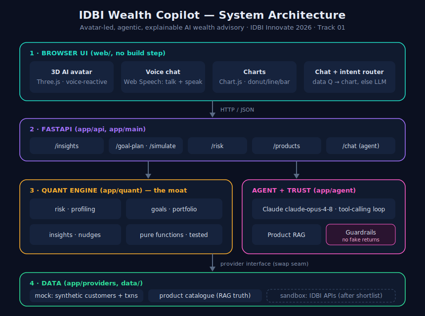

# IDBI Wealth Copilot — Documentation

**Aanya** is an avatar-led, agentic, explainable AI wealth advisor built for **IDBI Innovate 2026 · Track 01 (Wealth Advisory)**. It gives every customer bank-grade, personalised guidance — grounded in their own transaction behaviour, shown as charts, spoken aloud by a 3D avatar, and protected by compliance guardrails enforced in code.



## What's in this folder

| Doc | What it covers |
|-----|----------------|
| [ARCHITECTURE.md](ARCHITECTURE.md) | The four layers, tech stack, repo map, and the data-provider swap seam |
| [HOW_IT_WORKS.md](HOW_IT_WORKS.md) | End-to-end: intent routing, each visual flow + the math, the agent loop, guardrails, voice, the 3D avatar, theming |
| [API.md](API.md) | Every HTTP endpoint with example requests and responses |
| [DEMO_GUIDE.md](DEMO_GUIDE.md) | How to run it + a 3-minute Demo-Day script mapped to the judging criteria |
| [screenshots/](screenshots/) | Screenshots of every screen (see [screenshots/README.md](screenshots/README.md) to add them) |

## The 60-second version

- **Two ways to get answers.** Type or tap a question. **Data questions** ("show my spending", "plan ₹50L house in 8 years", "my risk profile") are answered **instantly as charts** by a pure-Python quant engine — no API key needed. **Open-ended questions** go to the **Claude agent**, which composes tools and is wrapped in guardrails.
- **A real engine, not a chatbot.** Risk profiling, goal-based SIP planning, portfolio construction and behavioural insights are all computed and explainable — this is the moat.
- **Compliant by design.** The copilot can never promise guaranteed returns or cite a product it didn't look up. The validator is in code and unit-tested.
- **Avatar + voice.** A Three.js 3D AI avatar reacts to listening/thinking/speaking; the Web Speech API lets you talk to Aanya and hear her reply.

## Run it

```bash
./start.sh           # http://localhost:8000   (setup + run)
./start.sh test      # run the test suite
```

See [DEMO_GUIDE.md](DEMO_GUIDE.md) for the full walkthrough.
